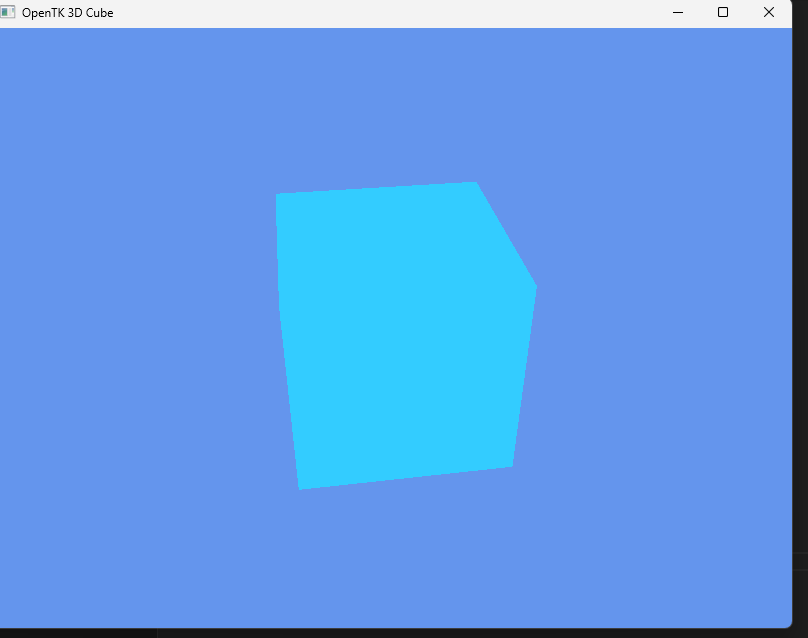

# OpenTKCubeDemo

## GitHub Repository
[Link to repository](https://github.com/Alex82728/GAM531/tree/main/Projects/OpenTKCubeDemo)

## Library Used
This project uses **OpenTK** (Open Toolkit Library) for 3D graphics rendering in C#.

## Cube Rendering Explanation
The 3D cube is rendered using OpenGL through OpenTK:

1. **Vertex Data:** The cube's 8 vertices and 36 indices (2 triangles per face) are stored in arrays.
2. **Buffers:** Vertex Buffer Object (VBO), Element Buffer Object (EBO), and Vertex Array Object (VAO) are created and bound.
3. **Shaders:** Vertex and fragment shaders handle transformations and coloring.
4. **Transformations:**  
   - **Model:** The cube rotates around the Y-axis over time.  
   - **View:** Camera looks at the cube from a distance.  
   - **Projection:** Perspective projection simulates depth.
5. **Drawing:** `GL.DrawElements` draws the cube each frame.

## Screenshot

